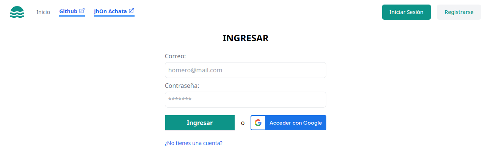
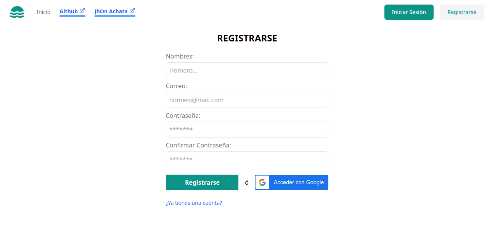

# TODO APP

Aplicación de gestión de tareas por proyectos.

## Tecnologías

-   NodeJS
-   ExpressJS
-   Express Validator
-   JWT
-   MongoDB
-   Mongoose
-   VueJS 3 (composition API)
-   Pinia
-   Vue Router

## Instalación

### Backend

```bash
cd ./api

cp .env.example .env

npm install

npm run dev
```

### Frontend

```bash
cd ./app

cp .env.example .env

npm install

npm run dev
```

## Características

-   Autenticación por token (Inicio de sesión y registro de usuarios)
-   Autenticación con google
-   Proyectos por usuarios (CRD)
-   Tareas por proyectos (CRD)

## Capturas

### Página de inicio


### Página de inicio de sesión



### Página de registro



### Página de proyectos


### Página de tareas


